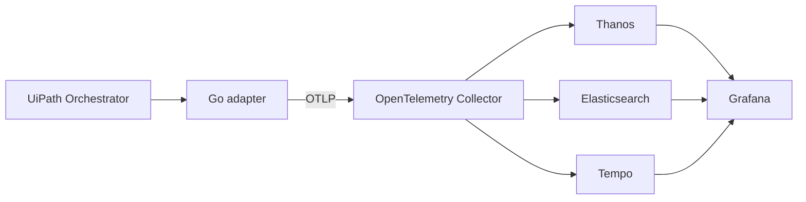

# uipath-otel-adapter

Collect UiPath Orchestrator metrics, robot logs and reconstructed execution
traces and export all three signals over OTLP/HTTP protobuf.

The adapter speaks only UiPath and OTLP. Backend routing belongs to the receiver.
A local Docker Compose stack routes metrics to Thanos, logs to Elasticsearch,
and traces to Tempo, with a provisioned Grafana dashboard.



## Try the synthetic demo

Requirements: Docker with Compose v2; Go 1.25+ for local development. Allocate
approximately 4 GiB of free Docker memory for the observability stack.

```sh
docker compose --profile demo up -d --build
python3 scripts/smoke.py --installation demo --log-record-uid
```

Open [UiPath monitoring](http://localhost:13000/d/uipath-overview/uipath-monitoring).
Sign in at http://localhost:13000/login with `admin` / `admin` to edit the local
dashboards. Anonymous access remains available with the Viewer role.

The demo generates a completed job every 30 seconds, including synthetic failures,
robot logs, active jobs and a queue item. Live counters intentionally exclude
bootstrap history; allow a few minutes for rate and percentile panels.

| Local service | Address |
| --- | --- |
| Grafana dashboard | http://localhost:13000/d/uipath-overview/uipath-monitoring |
| OTLP/HTTP receiver | http://localhost:14318 |
| Thanos query API | http://localhost:19090 |
| Elasticsearch API | http://localhost:19200 |
| Tempo API | http://localhost:13200 |
| Collector health | http://localhost:13133 |

Published ports bind to loopback. This is a development stack without backend
authentication. Runtime telemetry lives in Docker volumes, never in fixtures or
dashboard JSON. The demo and live adapter use separate state volumes and source
identities. The local pipeline omits Kafka/Logstash to keep the development loop
small; the adapter can use any compatible OTLP receiver.

Stop the synthetic producer when switching to live data:

```sh
docker compose --profile demo stop demo-adapter mock
```

`docker compose down` preserves volumes. Adding `--volumes` deletes local
telemetry and checkpoints; restarting after that will bootstrap historical data.

## Connect a real Orchestrator

Create an ignored private configuration, using the neutral example as a guide:

```sh
mkdir -p .local
chmod 700 .local
cp .env.example .local/adapter.env
chmod 600 .local/adapter.env
# Edit .local/adapter.env with your URL, client ID, secret and target identity.
docker compose --profile live up -d --build
python3 scripts/smoke.py --installation my-installation
```

Use a read-only external application with explicit folder permissions. The
default scopes cover folder discovery, jobs and robot logs. Scope issuance does
not imply folder authorization. Queue collection is optional and requires the
appropriate queue permissions/scopes.

For an SSH tunnel, keep the original HTTPS hostname in `UIPATH_URL` and set
`UIPATH_DIAL_ADDRESS=host.docker.internal:18443` for the container (or
`127.0.0.1:18443` for a host process). The adapter changes only the TCP destination,
preserving the HTTP Host and TLS SNI. The OAuth URL defaults to
`UIPATH_URL/identity/connect/token`; set `UIPATH_TOKEN_URL` if the identity service
is hosted elsewhere. A dial override applies only to the source URL's hostname.
On Linux, configure the host-gateway mapping for `host.docker.internal` if needed.

Trust an appropriate CA bundle using `UIPATH_CA_FILE`. Mount private files through
an ignored Compose override with permissions readable by UID 10001. The explicit
`UIPATH_TLS_INSECURE=true` option is for isolated development only; it defaults to
false. The OTLP client always verifies HTTPS certificates.

The live profile reads its secret from the private env file. The binary also
supports `UIPATH_CLIENT_SECRET_FILE` for deployment-mounted secrets. Neither
credentials nor response bodies are printed in application errors. Keep private
config, API captures, screenshots, state and real telemetry out of Git. `.local/`
and env files are excluded from Git and the Docker build context. Only synthetic
examples belong in tests.

For a host-native adapter with Docker backends:

```sh
docker compose up -d
# Supply configuration through your environment/secret manager.
go run ./cmd/uipath-otel-adapter --once
# Continuous polling:
go run ./cmd/uipath-otel-adapter
```

Compose explicitly selects its internal Collector endpoint; a host process
uses `http://localhost:14318` by default. Do not run two processes with the same
source identity or database. `--once` attempts collection and delivery and exits
nonzero on an error; pending batches survive for the next run.

## Configuration

| Variable | Default / meaning |
| --- | --- |
| `UIPATH_URL` | Required Orchestrator base URL |
| `UIPATH_CLIENT_ID` | Required external application ID |
| `UIPATH_CLIENT_SECRET` / `UIPATH_CLIENT_SECRET_FILE` | Required secret; file takes precedence |
| `UIPATH_TOKEN_URL` | Base URL plus `/identity/connect/token` |
| `UIPATH_SCOPES` | `OR.Folders.Read OR.Jobs.Read OR.Monitoring.Read` |
| `UIPATH_FOLDER_IDS` | Comma-separated allowlist; empty discovers all authorized folders |
| `UIPATH_INSTALLATION`, `UIPATH_TENANT` | Stable source identifiers; both default to `default` |
| `UIPATH_ENVIRONMENT` | `development`; describes the monitored system |
| `UIPATH_DIAL_ADDRESS` | Optional TCP destination override for tunnels |
| `UIPATH_CA_FILE` | Optional additional trusted CA bundle |
| `UIPATH_TLS_INSECURE` | `false`; explicit source-only development override |
| `OTEL_EXPORTER_OTLP_ENDPOINT` | `http://localhost:14318`; base URL, without a signal path |
| `OTEL_EXPORTER_OTLP_PROTOCOL` | `http/protobuf`; gRPC is not implemented |
| `OTEL_EXPORTER_OTLP_HEADERS` | Comma-separated `key=value` headers; percent-encoded values supported |
| `OTEL_EXPORTER_OTLP_CERTIFICATE` | Optional receiver CA bundle |
| `OTEL_EXPORTER_OTLP_CLIENT_CERTIFICATE`, `OTEL_EXPORTER_OTLP_CLIENT_KEY` | Optional mTLS client files |
| `POLL_INTERVAL` | `60s`; polling is sequential and bounded |
| `INITIAL_LOOKBACK` | `24h`; bootstrap jobs, then overlap reconciliation plus nonterminal jobs |
| `LOG_INITIAL_LOOKBACK` | `1h`; bootstrap robot-log window |
| `LOG_OVERLAP` | `5m`; reconciliation window for late source records |
| `HTTP_TIMEOUT` | `30s` |
| `METRIC_FRESHNESS` | `3m`; suppress stale active-job/queue snapshots |
| `PAGE_SIZE` | `100`; maximum 1,000 |
| `MAX_RECORDS` | `5000` per dataset/folder/cycle; maximum 10,000 |
| `MAX_PENDING_BATCHES` | `2000`; includes quarantined log/trace batches |
| `COLLECT_LOGS` | `true` |
| `INCLUDE_LOG_MESSAGES` | `false`; otherwise fetch and export the original message body |
| `INCLUDE_LOG_RECORD_UID` | `false`; opt in to SemConv v1.43.0's Development `log.record.uid` for stable log identity |
| `COLLECT_QUEUES` | `false`; collects queue inventory, active items and recent transaction outcomes |
| `QUEUE_HISTORY_LOOKBACK` | `24h`; rolling EndProcessing window, separate from dashboard time range |
| `STATE_PATH` | `.local/state.db`; container default `/data/state.db` |
| `LISTEN_ADDRESS` | `127.0.0.1:8088`; container default `0.0.0.0:8088` |

`GET /healthz` reports process availability. `GET /readyz` becomes successful
after the first collection attempt; remote API health is reported separately in
telemetry. Observe missing telemetry at the receiver as well: a broken OTLP path
also interrupts the adapter's exported self-metrics.

## Data and reliability contract

- Jobs are reconciled by stable key across folders. Nonterminal jobs remain in
  the query even when created before the bootstrap window.
- One completed INTERNAL span represents a job's actual start/end timestamps.
  Elapsed duration includes suspension. These are reconstructed summaries, not
  instrumented workflow activities. Faulted jobs have ERROR status; cancellations
  retain their original state without automatically becoming failures.
- Versioned, source-scoped hashes create stable trace/span IDs. Job lifecycle logs
  and known robot-job relationships use the native OTLP trace context. Unknown
  jobs remain uncorrelated. IDs do not imply downstream delivery or deduplication.
- Source checkpoints, deduplication and log/trace outbox batches commit together
  in bbolt. The file is single-writer and bound to source URL/installation/tenant.
- The OTLP sender handles protobuf responses, transient retries and Retry-After.
  Partial/permanent rejections are quarantined rather than automatically
  replaying a partly accepted batch. Only the latest rejected metric snapshot is
  retained, while log/trace rejection batches remain individually available.
  Inspect the private state before manual
  recovery. An ACK proves acceptance at that hop, not storage in the final backend.
- Gauge data and cumulative sums/histograms are exported as replaceable current
  snapshots. Completed-job totals, buckets and accumulation start time persist
  across restart. Historic bootstrap jobs update last-success/last-duration and
  appear in logs/traces, but do not inflate live completion counters.
- API errors, caps and invalid identity/timestamps produce coverage failures,
  not zeros. A slow or failed log/trace output does not suppress the other signal.
- Polling RobotLogs currently requires stable positive IDs. Reused IDs with a
  different timestamp are rejected. Sources exposing only zero IDs require a
  future fingerprint strategy or native log forwarding; content hashing is not
  silently substituted.
- The API has storage-dependent pagination/filter limitations. The implementation
  supports bounded `$top`/`$skip` pagination; a server-driven next link is an
  explicit gap. Reaching the configured cap is a failure, even at an exact match.
  Overlap tolerates bounded late arrivals; it cannot prove completeness beyond
  source retention or under arbitrary concurrent source mutation.
- Queue snapshots include inventory, explicit zeros after complete reads, eligible/deferred
  backlog, overdue work and rolling transaction outcomes. Shared folder views must
  be deduplicated by tenant and queue ID; the dashboard does this before totals.
  Sessions, licensing, audit logs,
  workflow instrumentation, HA and deletion/correction reconciliation are future
  work. Missing queue series are not proof of an empty queue.

This is an initial runnable implementation, not an exactly-once or audit archive.
The local Collector has persistent exporter queues, but configuration errors, disk
failure and permanent backend rejection can still cause gaps. All backends should
be initialized before sending real data. In particular, create the Elasticsearch
data stream and enforce the intended mapping in the pipeline.

## Development

```sh
go test -race ./...
go vet ./...
python3 -m unittest discover -s scripts -p "test_*.py" -v
python3 scripts/generate-dashboard.py
docker compose config --quiet
```

The tests use synthetic records and local HTTP servers. They cover token refresh,
folder headers, pagination caps, checkpoint rollback, replay/restart deduplication,
OTLP responses, histogram buckets, timestamp/correlation semantics, bootstrap
behaviour, source binding, staleness, partial rejection and independent signal
retries. `scripts/smoke.py` checks actual backend results and retrieves a trace
referenced by an indexed log; it prints counts only.

See [telemetry contract](docs/telemetry.md) for metric names and semantic versions.
The dashboard provides named folder selection, process and log-level filters,
collection coverage, and an execution history table (latest 100 lifecycle events).
Queue panels have their own named selector and ignore the process filter. Their
rolling outcome window defaults to 24h, independently of the dashboard time range.
Current active-job counts remain folder-scoped; process filters apply to execution
metrics, logs and traces. Older events retain their original fields.

Metrics use standard OTLP service identity (`job`/`instance` after translation).
The dashboard obtains installation and tenant metadata through `target_info`
joins; no application-specific resource promotion is required in Thanos. Use a
unique installation identifier for each monitored source. When upgrading from
the earlier promoted-label contract, deploy the adapter and dashboard together:
old series remain stored but are not selected by the new dashboard. See the
[identity and migration contract](docs/telemetry.md).

The dashboard JSON is generated from neutral queries; it contains no runtime
inventory, endpoints or samples from a monitored installation.

To exercise metric identity without promotion, run the synthetic demo and a
second tenant against the same mock (the temporary state stays in that container):

```sh
docker compose --profile demo run -d --no-deps --name uipath-demo-tenant-b \
  -e UIPATH_TENANT=tenant-b -e STATE_PATH=/tmp/tenant-b.db demo-adapter
# Allow at least one minute for counter-rate samples.
python3 scripts/check-metric-identity.py
docker rm -f uipath-demo-tenant-b
```

This verifies two distinct source instances, unpromoted metric labels and all
metric dashboard queries, including metadata joins. For an isolated Compose
project with different port mappings, pass `--metrics-url` to the check.
